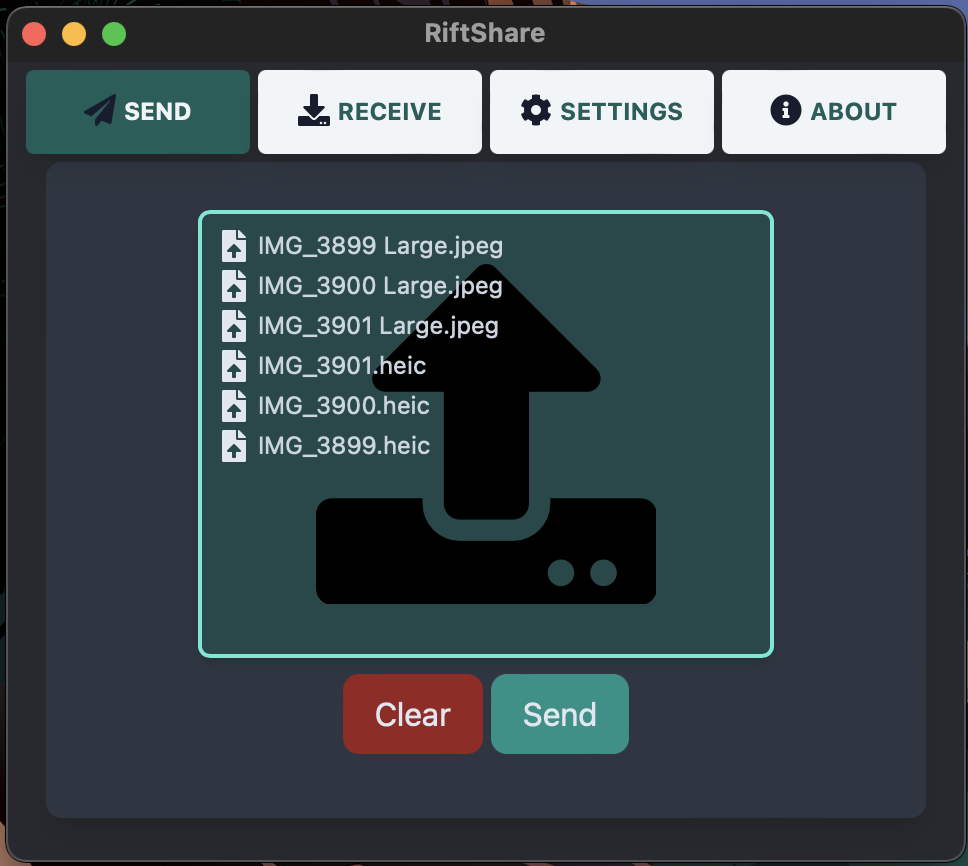

# RiftShare

## About

RiftShare is an app inspired by a few amazing Github projects. 
* [magic-wormhole](https://magic-wormhole.readthedocs.io/en/latest/)
* [wormhole-william](https://github.com/psanford/wormhole-william)
* [wormhole-gui](https://github.com/Jacalz/wormhole-gui)

The goal was for me to get more familiar with Wails v2 and see the art of the possible. I would love to use this project to enable my friends and family to be able to securely share files across the globe. Most will not use a CLI utility, they need something easy and beautiful to use. 

## Features

* Easy secure file sharing between computers both in the local network and through the internet
* Supports sending files or directories through magic wormhole protocol
* Automatic zipping of multiple files that are selected
* Full animations, progress bar, and cancellation support for sending and receiving
* Native OS File Selection
* Open files in one click once received
* Self updating binary - don't worry about having the latest release!

## Attributions

This project is built leveraging the following Go Modules:
* Wails-v2
* wormhole-william
* compress
* go-github-selfupdate

Frontend Built Using:
* Svelte
* TailwindCSS
* FontAwesome

## Using it

Sending Files

Receiving Files

TODO

## Live Development

To run in live development mode, run `wails dev` in the project directory. The frontend dev server will run
on http://localhost:34115. Open this in your browser to connect to your application.

## Building

For a production build, use `wails build`.

## Contributing

TODO

## License

Licensed under the GNU General Public License v3.0